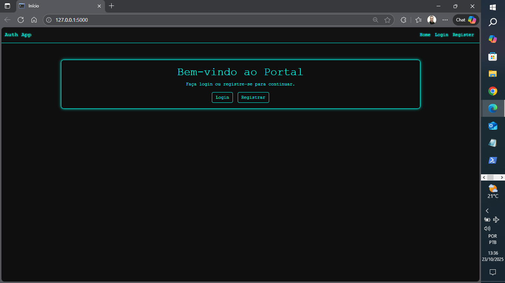

# AuthApp: Sistema Básico de Autenticação com Flask

  

## 🚀 Visão Geral
Um aplicativo web simples e seguro construído com Flask para gerenciar autenticação de usuários. Inclui funcionalidades essenciais como cadastro (register), login e logout, com armazenamento de senhas hasheadas para segurança. Ideal como base para projetos maiores em desenvolvimento web, como sistemas de gestão ou apps de logística – demonstra conhecimentos em backend Python, rotas RESTful e integração com banco de dados.

**Por que isso é útil?**  
- Foco em segurança: Usa werkzeug para hash de senhas.  
- Estrutura modular: Fácil de estender para features como dashboards ou APIs.  
- Aplicações reais: Pode ser integrado a projetos de logística (ex: autenticação para rastreamento de entregas) ou mobilidade (ex: login para apps de frota).  

## 🎥 Demonstração

### Home 

### Tela de Cadastro

### Tela de Login

## 🛠️ Tech Stack
- **Backend**: Flask, Flask-Login (para sessões), Werkzeug (para segurança).  
- **Banco de Dados**: SQLite (fácil para desenvolvimento; escalável para PostgreSQL).  
- **Frontend**: HTML/CSS básico com Jinja2 templates (pode adicionar Bootstrap para responsividade).  
- **Outros**: Virtualenv para ambiente isolado.

## 📋 Funcionalidades Principais
- **Cadastro (Register)**: Formulário para criar novos usuários com validação de email/username único.  
- **Login**: Autenticação segura com verificação de credenciais.  
- **Logout**: Limpa a sessão do usuário.  
- **Proteção de Rotas**: Páginas restritas só acessíveis após login.  

## 🏗️ Como Rodar Localmente
1. Clone o repositório:  
    git clone https://github.com/rdralves/.app
    cd app

2. Crie um ambiente virtual e instale dependências:  
   python -m venv venv
   source venv/bin/activate  # No Windows: venv\Scripts\activate
   pip install -r requirements.txt

3. Configure o app (adicione sua SECRET_KEY no app.py).  

4. Rode o servidor:  
    python run.py
    Acesse em http://localhost:5000/register para testar!

## 🤝 Contribuições
Sinta-se à vontade para fork e enviar PRs! Estou aberto a melhorias, como adicionar testes com pytest ou deploy.  

## 📫 Contato
- LinkedIn: https://www.linkedin.com/in/rodrigoalvesreis/

